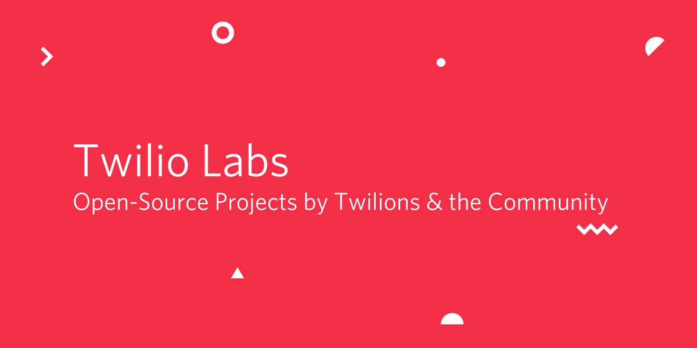

  

## What is Twilio Labs?

Twilio Labs host a variety of open-source projects that were developed by people 
at Twilio and the community. Every one of these projects welcomes contributions.

Feel free to submit issues, fixes or suggestions to improvements for the projects.

*We can't wait to see what you __build together__ with us*

## Examples

Here are some projects that are currently active:

- [twilio-run](https://github.com/twilio-labs/twilio-run)  _Develop locally and deploy to Twilio Functions_
- [serverless-api](https://github.com/twilio-labs/serverless-api)  _Node.js wrapper for the Twilio Runtime API_
- [function-templates](https://github.com/twilio-labs/function-templates)   _Collection of Function templates for Twilio Functions_
- [create-twilio-function](https://github.com/twilio-labs/create-twilio-function)  _CLI to bootstrap Twilio Function projects_
- [plugin-serverless](https://github.com/twilio-labs/plugin-serverless)  _A plugin for Twilio CLI to use `twilio-run`_
- [plugin-token](https://github.com/twilio-labs/plugin-token) _A plugin for the Twilio CLI to generate access tokens for client-side SDKs_
- [svg-to-react](https://github.com/twilio-labs/svg-to-react) _Tool that generates React components out of SVG files_
- [serverless-framework-integration](https://github.com/twilio-labs/serverless-framework-integration) _Twilio Runtime Integration for Serverless Framework_
- [plugin-flex-realtime-stats-dashboard](https://github.com/twilio-labs/plugin-flex-realtime-stats-dashboard) _Sample Twilio Flex plugin for a real time stats solution_
- [plugin-flex-outbound-dialpad](https://github.com/twilio-labs/plugin-flex-outbound-dialpad) _Sample Twilio Flex plugin for a dialpad solution that allows for conferencing and supervisor monitor_

## Code of Conduct

Your safety and comfort are important to us. Codes of Conduct let everyone know what’s expected, so we can do a better job of interacting with one another. All contributions to and interactions with Twilio's open-source projects have to adhere to our Code of Conduct. You can report violations at open-source@twilio.com.

<a class="twlo-link-btn" href="https://github.com/twilio-labs/.github/blob/master/CODE_OF_CONDUCT.md">Read the Code of Conduct <svg class="twlo-icon-interface-link-out" height="8" viewBox="0 0 8 8" width="8" xmlns="http://www.w3.org/2000/svg">
<path d="M8 8H7V1.7L.9 7.9l-.8-.8L6.3 1H0V0h8v8z" fill="currentColor"></path>
</svg></a>

# License

MIT

